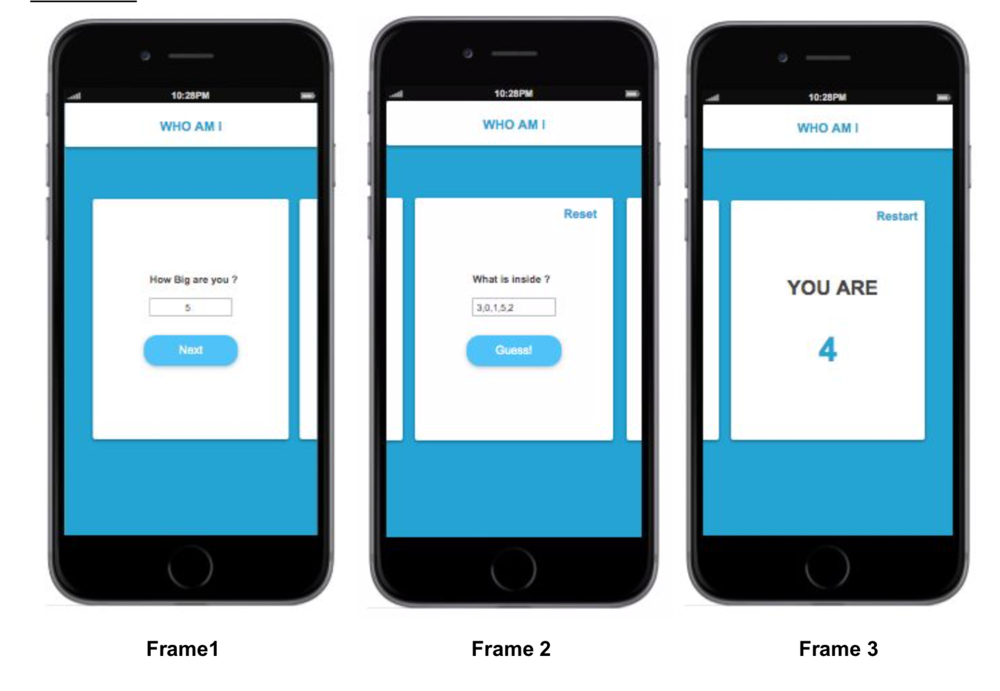

# Who am I

### Story:

As a User I want to guess the element missing in the box. WorkFlow:

- Enter the size of the box (number )​[Frame1]
- Enter the elements (numbers) that is inside the box separated by comma ‘ , ’.
  [Frame2].
- Show the missing number that is replaced by a 0 in the box ​[Frame3]

Frames:

### Constraints:

- 0<n<10​ -> n is the size of the box ​[Frame1].
- 0 < box[i] <=n​ -> the elements of the box should be ​unique​ and between 0 and
  n where n is the size of the array and 0<i<n.
- The missing number should be entered as 0.
  ​Frame1 ​Frame 2 ​Frame 3

### User Interaction:

- When the User click on the Button “Next” (Frame1) should Slide animate to the
  next Slide (Frame2).
- When the user click on “Reset” should empty the input.
- When the User click on the button “Guess” (Frame 2) should Slide animate to the
  next slide (Frame 3).
- When the User click on “Restart” should Slide him back to the first Slide. From
  Frame 3 to Frame 1.
- All the inputs should satisfy the Constraints mentioned above.
- The User should be able to go back to the previous Slide when he clicks on back
  icon which you have to choose where you want to put it in the Frame 2 and 3.
  Technical Requirements:
- The App should work on Both IOS and Android.
- For sliding animation, you have to use “Animated” where you can import it from
  react-native.(using Custom slider libraries should come in second place if you get
  stuck coding it yourself.)
- The Back Icon should be imported from ​react-native-vector-icons​ library.
- Nice to work on Hooks and latest React Native version ( >= v0.60)
- Nice to Use TypeScript.
- The UI/UX should look exactly the same as the Frames + adding the Back Icons
  (You are free to choose the primary color of the App).
- Use your Art of how we should show the validation errors to the User.
- Ideally , Finding the missing element should be resolved using one loop only
  where the function should accept an array as input and a number as output.
- Nice to Cover the UnitTests related to the inputs constraints and the algorithm of
  finding the missing number.

### License

This project is [MIT](LICENSE) licensed.
